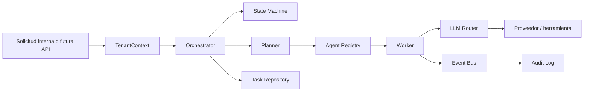

# Arquitectura de la máquina

## 1. Decisión fundamental

La máquina se construye como un **núcleo headless, modular y orientado a eventos**, no como una interfaz visual. La forma inicial es un monolito modular: ofrece menor complejidad operativa, pruebas reproducibles y límites de dominio claros. Sus puertos permiten extraer componentes a procesos independientes cuando haya señales reales de escala.

> La meta de esta etapa no es simular complejidad empresarial con infraestructura innecesaria. Es fijar un núcleo correcto, observable y reemplazable que pueda escalar sin perder control.

## 2. Mapa de capas

| Capa | Responsabilidad | Debe conocer | No debe conocer |
|---|---|---|---|
| `domain` | Entidades, estados, eventos y reglas puras | Tipos del dominio | Red, archivos, SDKs o secretos |
| `application` | Casos de uso, planificación y coordinación | Puertos y dominio | Implementaciones concretas |
| `security` | Contexto de tenant, autorización y acceso a secretos | Identidades y políticas | Lógica específica del proveedor |
| `adapters` | Implementaciones intercambiables de LLM y herramientas | Contratos de aplicación | Reglas internas de transición |
| `infrastructure` | Eventos, auditoría y almacenamiento temporal | Puertos | Decisiones de negocio |

## 3. Flujo de ejecución

El orquestador crea una tarea vinculada a un tenant, verifica las transiciones de estado, genera un plan y delega cada paso al worker. El worker solicita una capacidad registrada y autorizada; en el caso de inferencia, el router selecciona un proveedor elegible. Las decisiones y resultados se envían al bus de eventos y a la bitácora de auditoría.

## 4. Contratos internos

| Contrato | Razón para existir | Sustitución prevista |
|---|---|---|
| `TaskRepository` | Mantener tareas con control de tenant | PostgreSQL con filtros de tenant a nivel de servicio y base de datos |
| `EventPublisher` | Desacoplar efectos y observabilidad | Broker transaccional/cola de eventos |
| `AuditSink` | Evidencia operacional consistente | Almacenamiento WORM o SIEM con retención configurable |
| `LLMProvider` | Evitar dependencia de un modelo o proveedor | Adaptadores autenticados a proveedores aprobados |
| `Agent` | Registrar capacidades y permisos | Agentes especializados, herramientas y conectores de dominio |

## 5. Modelo de seguridad de partida

El núcleo aplica separación de tenants, autorización explícita de capacidades, secretos fuera del dominio, y trazabilidad de decisiones. Los adaptadores concretos no reciben secretos desde objetos de tarea; deben resolverlos mediante un proveedor de secretos de infraestructura. Todo acceso futuro a datos regulados debe incorporar clasificación, minimización de datos, retención, cifrado en tránsito y reposo, autenticación fuerte, y revisión independiente del programa de cumplimiento.

## 6. Camino de escalado

| Señal observada | Evolución técnica |
|---|---|
| Reinicios o necesidad de retención | Implementar `TaskRepository` en PostgreSQL y `AuditSink` durable. |
| Procesos de más de unos segundos | Desacoplar `Worker` mediante una cola y workers idempotentes. |
| Alto volumen o tareas heterogéneas | Separar routing, ejecución y memoria usando los contratos existentes. |
| Datos semánticos | Añadir puerto `MemoryStore` y una implementación vectorial con filtros de tenant. |
| Clientes externos | Añadir una capa de transporte autenticada; no modificar `domain`. |
| Requisitos regulados | Formalizar controles, gestión de evidencias, pruebas, evaluación externa y operación segura. |

## 7. Límites expresos de esta entrega

No hay API HTTP, interfaz gráfica, credenciales de terceros, envío de datos fuera de la máquina, telemetría remota, base de datos real, broker ni ejecución en segundo plano. La demostración usa adaptadores deterministas para validar la lógica sin coste ni exposición externa.
