# Sistema Operativo Comercial: Diseño de Captación y Propuestas

## Propósito

Este módulo convierte la máquina de orquestación en una base para una operación comercial repetible: **incorporar cuentas y contactos autorizados, cualificarlos, preparar propuestas relevantes, programar comunicaciones permitidas y registrar cada resultado**. No pretende prometer que alcanzará a «todo» cliente potencial; la cobertura depende del perfil de cliente ideal, los datos obtenidos lícitamente, los canales autorizados y la calidad de la propuesta.

> La automatización no debe sustituir la legitimidad del contacto ni la responsabilidad comercial. El sistema bloquea contactos sin base de contacto documentada, bajas, mensajes no aprobados y excedentes de frecuencia.

## Flujo operativo

```mermaid
flowchart LR
    A[Origen autorizado de cuenta/contacto] --> B[Normalización y deduplicación]
    B --> C[Validación de tenant, base de contacto y canal]
    C --> D[Perfil de cuenta y puntuación]
    D --> E[Generación de propuesta]
    E --> F[Revisión de política y aprobación]
    F --> G[Cola con límites de ritmo]
    G --> H[Proveedor de entrega]
    H --> I[Eventos, respuestas, baja y auditoría]
    I --> J[Actualización de CRM y siguiente acción]
```

## Orígenes y límites

| Elemento | Regla incorporada | Finalidad |
|---|---|---|
| Contacto | Debe pertenecer al tenant, incluir un origen y una base de contacto explícita. | Evitar registros sin procedencia o sin autorización operacional. |
| Exclusión | `do_not_contact`, rebote, baja o canal no permitido bloquean la cola y el envío. | Respetar preferencias y proteger la reputación del remitente. |
| Propuesta | Se compone desde una proposición de valor definida y queda sujeta a aprobación. | Evitar promesas inventadas o mensajes genéricos no revisados. |
| Frecuencia | El planificador aplica una cuota diaria por tenant y canal. | Controlar volumen y facilitar una activación gradual. |
| Entrega | Solo un gateway configurado con secretos de entorno puede entregar mensajes. | Separar credenciales y datos del núcleo de negocio. |
| Evidencia | Cada aceptación, bloqueo, propuesta y entrega se registra como evento. | Dar trazabilidad para mejora y revisión. |

## Entidades de datos

| Entidad | Identidad y campos esenciales | Estados |
|---|---|---|
| `Account` | `id`, `tenant_id`, nombre, dominio, segmento, perfil y puntuación | activa, descalificada, cliente |
| `Contact` | `id`, `tenant_id`, `account_id`, correo, rol, origen, base de contacto, fecha y baja | elegible, suprimido, rebotado |
| `Proposal` | `id`, `tenant_id`, `account_id`, asunto, cuerpo, oferta, aprobador y versión | borrador, aprobada, retirada |
| `OutreachMessage` | `id`, `tenant_id`, contacto, propuesta, canal, intento, ventana y resultado | borrador, lista, enviada, respondida, fallida, suprimida |
| `Suppression` | `tenant_id`, valor de contacto, canal, motivo y fecha | activa |
| `AuditEvent` | actor, recurso, decisión, timestamp y metadatos mínimos | solo anexión |

## Política de comunicación

La entrega automática se permite únicamente si concurren todas estas condiciones: el contacto es elegible; el canal está permitido; existe una base de contacto registrada; no hay baja, rebote o supresión; la propuesta fue aprobada; la cuota diaria no se supera; y el proveedor de entrega se encuentra configurado. Las respuestas y bajas deben actualizar el estado de la relación antes de programar cualquier seguimiento.

Los adaptadores de adquisición de contactos quedan deliberadamente separados del núcleo. La primera integración permitida será una importación desde una fuente de datos que el usuario controle o que exponga una base de contacto documentable. El sistema no incorpora extracción opaca de datos personales ni mecanismos para ocultar la identidad del remitente.

## Integración con el núcleo existente

| Puerto de la máquina | Extensión comercial |
|---|---|
| `TaskRepository` | Persistencia de cuentas, contactos, propuestas, mensajes y supresiones. |
| `EventPublisher` | Eventos `contact.accepted`, `proposal.approved`, `outreach.blocked`, `outreach.sent`, `contact.suppressed`. |
| `AgentRegistry` | Capacidades futuras `lead.qualify`, `proposal.compose`, `outreach.deliver`, `reply.classify`. |
| `CapabilityPolicy` | Permisos por rol y tenant para importar, aprobar, programar y enviar. |
| `SecretProvider` | Credenciales de correo, CRM y fuentes de datos fuera del código. |

## Ruta de activación

| Etapa | Resultado verificable | Dependencia |
|---|---|---|
| 1. Fundaciones | Registro de contactos, supresión, propuesta y cola con pruebas. | Incluida en el repositorio. |
| 2. Persistencia | Base de datos durable, migraciones, deduplicación y retención. | Elección de infraestructura. |
| 3. Conectores | Importador de fuente autorizada, CRM y proveedor de correo. | Credenciales y política comercial del usuario. |
| 4. Activación gradual | Primer grupo pequeño con métricas de entrega, baja y respuesta. | Aprobación de la oferta y contenido. |
| 5. Optimización | Segmentación, experimentos, atribución y siguiente acción. | Datos de interacción suficientes. |

## Secretos requeridos para entrega SMTP

El adaptador ejecutable de SMTP exige `SMTP_HOST`, `SMTP_PORT`, `SMTP_USERNAME`, `SMTP_PASSWORD` y `SMTP_FROM`. La aplicación no guarda secretos en archivos, repositorio, tareas ni eventos. Una implementación productiva debe entregar estos valores desde un gestor de secretos y rotarlos según el procedimiento operativo del tenant.
